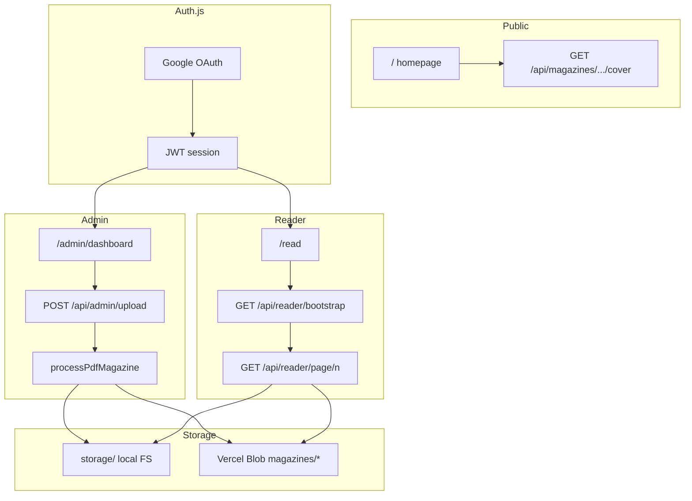

# Architecture

This document describes how Street Voice Magazine is structured and how data flows through the system.

## High-level diagram

## PDF processing pipeline

Entry point: `lib/server/pdf-processor.ts` → `processPdfMagazine()`.

1. **Catalog** — If `setAsCurrent`, archive the previous current edition’s assets via `archivePreviousCurrentEdition`.
2. **Clear** — Remove existing WebP assets for the edition ID under the target storage root.
3. **Render** — `renderPdfPages()` (`lib/server/pdf-render.ts`) uses `pdf-to-img` / `pdfjs-dist` to produce PNG buffers per page.
4. **Variants** — For each page, `generatePageVariants()` writes thumb/mobile/tablet/desktop WebP. Page 1 PNG also feeds cover generation.
5. **Meta** — Write `meta.json` (title, headline, summary, pageCount, status, cacheVersion, etc.) and upsert the edition in the catalog.
6. **Discard PDF** — Source PDF is not persisted after processing (only WebP outputs remain).

Processing steps are logged via `ProcessingLog` and returned in the upload API response for debugging.

## Storage abstraction

`lib/server/asset-store.ts` implements a single interface over:

| Concern | Local (`storage/`) | Blob (`magazines/`) |
|---------|-------------------|---------------------|
| Enabled when | No `BLOB_READ_WRITE_TOKEN` | Token present |
| Catalog | `storage/catalog.json` | `magazines/catalog.json` |
| Current edition root | `storage/current-edition/` | `magazines/editions/{id}/` |
| Archive | `storage/archive/{id}/` | Same blob prefix pattern |

Path helpers live in `lib/server/paths.ts`. Legacy flat page paths (`pages/001.webp`) are still resolved for older data.

## Catalog and editions

Types: `lib/types/magazine.ts`.

- **Catalog** — `currentEditionId` + `editions[]` summary records
- **Edition meta** — Full metadata file per edition (`meta.json`)
- **Status** — `draft` or `published` (default published). Draft covers are admin-only.
- **Current** — Exactly one edition may be “current” for reading; page APIs for `/api/magazines/[id]/pages/[n]` only serve the current published edition.

Business logic: `lib/server/catalog.ts` (normalization, `getCurrentEdition`, public DTOs with cover URLs).

## Asset delivery and CDN

`lib/server/magazine-access.ts` builds URLs like:

`/api/magazines/{id}/pages/{n}?v=desktop&cv={cacheVersion}`

`lib/server/cdn.ts` prefixes with `CDN_URL` or `NEXT_PUBLIC_CDN_URL` when set.

Response headers (cache, ETag) come from `assetResponseHeaders()` in the route handlers.

### Two page-serving paths

| Route | Who | Protection |
|-------|-----|------------|
| `/api/magazines/[id]/pages/[page]` | Current edition only | Published + current check; no reader cookie |
| `/api/reader/page/[page]` | Logged-in reader | Requires `sv_reader` HMAC cookie; referer must match host |

The in-app reader uses the **reader** routes after `bootstrap` sets the cookie (`lib/server/reader-session.ts`). Tokens bind to an edition ID and expire after four hours.

## Authentication and authorization

- **Config** — `auth.config.ts` (shared) + `auth.ts` (Google provider)
- **Middleware** — `middleware.ts` runs Auth.js `authorized` callback for matched paths
- **Roles** — `lib/auth/roles.ts` compares session email to `ADMIN_EMAIL`
- **Admin API** — `requireAdminApi()` accepts admin session **or** `x-admin-secret` (`lib/auth/guards.ts`)

Email/password registration is disabled (`/api/auth/register` returns 503).

## Frontend reader

- **Page** — `app/read/page.tsx` + `components/magazine/ProtectedMagazineViewer.tsx`
- **Hooks** — Virtual window, nearby preload, blob prefetch, reader variant selection
- **Client cache** — `lib/reader/page-cache.ts`, `lib/reader/fetch-page.ts`

Watermarks are applied client-side (`PageWatermark`) using the user email from bootstrap.

## Admin UI

Under `app/admin/dashboard/`:

- **Upload** — `AdminUploadForm` → `/api/admin/upload`
- **Editions** — `EditionManager` / `EditionList` → `/api/admin/editions`
- **Homepage** — `SiteSettingsForm` → `/api/admin/site-settings`

Shell layout: `components/admin/DashboardShell.tsx`.

## Key API reference

### Public / semi-public

| Method | Path | Notes |
|--------|------|-------|
| GET | `/api/magazines` | Edition list for homepage |
| GET | `/api/magazines/current` | Current edition metadata |
| GET | `/api/magazines/[id]/cover?v=` | Cover WebP; draft needs admin session |

### Authenticated user

| Method | Path | Notes |
|--------|------|-------|
| GET | `/api/reader/bootstrap` | Sets reader cookie, returns edition + page list |
| GET | `/api/reader/page/[page]?v=` | Serves WebP with reader cookie |
| GET/PATCH | `/api/user/profile` | Profile fields |
| GET/PATCH | `/api/user/preferences` | Reading preferences |

### Admin

| Method | Path | Notes |
|--------|------|-------|
| POST | `/api/admin/upload` | PDF multipart upload |
| GET/POST | `/api/admin/editions` | Catalog management |
| GET/PATCH/DELETE | `/api/admin/editions/[id]` | Single edition |
| GET/PATCH | `/api/admin/site-settings` | Homepage content |
| GET | `/api/admin/status` | Health / storage mode |

## Configuration files

| File | Role |
|------|------|
| `next.config.ts` | External packages, 80MB server action limit |
| `auth.config.ts` | Session strategy, route guards, callbacks |
| `middleware.ts` | Path matcher for auth |
| `lib/magazine-assets.ts` | WebP width/quality presets |

## Local development tips

1. Without Blob token, all assets land in `storage/` (gitignored). Delete `storage/` to reset.
2. Use `ADMIN_SECRET` + seed script to upload without clicking through the UI.
3. On Windows, run `test-pdf-pipeline.mjs` first if full upload fails — isolates PDF/Sharp issues.
4. Set `ADMIN_EMAIL` to your Google account before testing the dashboard.
